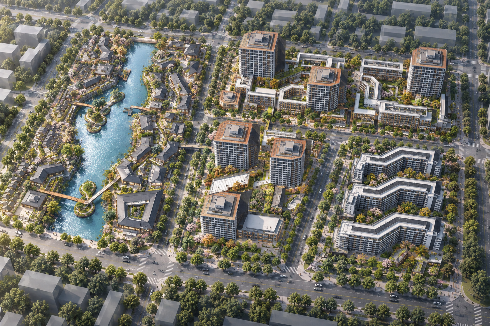

# 3D城市 · 空间尺度实验室

把用户提供的滨水街区手绘总平面图，人工概括为可旋转、可漫游的三维教学体块。优先帮助城市规划设计学生理解建筑高度、街道尺度、滨水空间和围合。v0.2 加入窗户、屋顶、分簇树冠、光影和可更换的随机周边，改善三维表现。

**[查看 GitHub 仓库](https://github.com/1103416806-hub/3d-city)** · GitHub Pages 待部署验证



## 核心体验

- 在同一个三维场景中切换鸟瞰、顶视和 1.7 米人视漫游。
- 根据图纸层数生成建筑高度；未标层数的滨水小建筑使用 1–3 层的保守估计。
- 道路连续穿过街区，交叉口带圆角；滨水建筑使用坡屋顶，周边以玻璃体量表达。
- 支持建筑高度、整体层高倍率和道路宽度调整，并能测量平面距离。
- 支持导出 GLB 模型和当前三维画面 PNG。

## 本地体验与在线发布

源码包不包含构建产物。安装 Node.js 后，先在项目目录执行 `npm ci` 和 `npm run build`，再双击 `启动3D城市.cmd`，浏览器将打开 http://127.0.0.1:5178/ 。桌面启动器不会加入开机启动。

仓库包含 GitHub Pages 发布工作流。启用 Pages 并成功完成部署后，预期访问地址为 https://1103416806-hub.github.io/3d-city/ 。当前尚未核验在线部署结果。

## 使用方式

1. 打开即显示这张参考图的 28 个近似建筑体块。
2. 拖拽旋转，滚轮缩放，右键平移；切到「顶视」对照布局。
3. 选择「滨水漫步」「街道尺度」「院落之间」，以离脚下地面 1.70 米的视线进入模型。拖动环顾，WASD 或屏幕方向按钮移动。碰撞阻止穿过建筑与水面，但不是完整物理模拟。
4. 点击建筑修改基础高度；整体建筑倍率可以比较不同高低状态。路面宽度调整铺装，不移动建筑。
5. 测距工具依次选取地面两点，显示当前米制比例下的水平距离。改变模型会清除旧测距。
6. 在「画面表现」切换材质与光影/教学体块，开关周边环境，或随机更换周边。外围街区、立面和景观均为示意设计，不是原图外实景。
7. 可以导出以米为单位的 GLB 模型和当前三维视图 PNG。GLB 用于支持该格式的三维工具。
8. 「鸟瞰效果」提供本次图纸生成的静态 AI 效果示意，可保存 PNG。它不随模型参数修改更新，也不作为测量依据。

## 这张图的假设

- 图幅暂设为 **480 × 330 米**，建筑基础总高 **6–63 米**；均为教学假设，可校准。
- 六栋主塔楼按屋面轮廓改为闭合体块，不再把屋面黑线直接解释为贯通的大型 U 形庭院。屋顶机房和女儿墙包含在设置的总高内。
- 原图有疑似 **21F、17F、11F** 等文字，辨读可靠程度不同。以假设的 **3 米/层** 生成 63、51、33 米初始候选高度；选中建筑能看到推断来源。文字与层高都需要核实，不代表真实测量结果。
- 主黑影大致朝图面右上，光源方向据此作示意；局部粗描边与屋顶符号没有用于量影长。缺少可信太阳高度、投影面和图纸比例，不能从阴影推导精确楼高。
- 水体、路网和建筑占地依据图面人工近似。右下折线楼沿白色屋面边缘修正，排除黑色投影面积。
- 树木、人物、汽车和楼层分线是尺度参照，非原图复原的立面或景观设计。
- 首版没有真实地形、日照分析、建筑规范校核和多楼层室内漫游。

## 其他图纸

「导入另一张图纸」支持 JPG、PNG、WebP。新图从空白体块开始，手动校准图幅宽度与进深后，在「平面描摹」依次点击每栋建筑的角点并设置高度。不会假装自动提取建筑。导入会替换当前练习；练习只在当前页面保留，请在刷新或离开前导出模型。

原图在浏览器本地解码，不上传到外部服务。界面使用本机中文字体，不依赖境外字体服务。参考图保存在 `public/reference.jpg`。尚未接入任何 AI 生图接口。

本次鸟瞰效果示意由 Codex 内置 image_gen 在制作阶段生成，使用用户原图和城市效果截图作为布局/风格参考。应用本身没有自动生图调用。示例效果图随源码保存在 [public/ai-birdseye-study.png](public/ai-birdseye-study.png)。AI 图中的立面、景观与局部几何是生成解释，不代表图纸精确复原。

## 继续开发

这是独立的 React + Vite + Three.js 原型。在线发布前，需在仓库的 Settings → Pages 中选择 GitHub Actions 作为发布来源；随后推送到 `main` 分支可触发构建与部署。以 Actions 中的部署结果确认是否上线。

```text
npm install
npm run dev
npm run build
```

后续优先方向：图幅裁切与两点标尺校准、图像识别候选轮廓与人工修正、项目保存、按真实层数设高。完成体验验证后再选择微信小程序或移动端封装。Skill 可以承担「解读图纸 → 生成轮廓与尺寸假设 → 输出模型」步骤，持续的空间漫游由这个三维工作台承载。

## 国内图像/三维模型接入候选

以下根据 2026-09-11 厂商官方能力说明整理，尚未以本图实测，不是效果排名。

- [字节 Seedream](https://www.volcengine.com/docs/82379/1829186)：多图参考和图片编辑，可评估「固定相机白模 + 材质参考 + 景观参考 → 二维效果图」。
- [阿里 Qwen-Image](https://help.aliyun.com/zh/model-studio/qwen-image-edit-api)：中文图片编辑、多图输入与国内 API，可与 Seedream 做相同输入的结构保持对照。
- [腾讯 HY-3D-Texture](https://cloud.tencent.com/document/product/1823/137183)：对已有 OBJ/GLB 生成纹理，更适合探索将效果保留在可漫游的三维资产中。接入前需核验场景大小、面数及输出几何是否保持一致。

二维生图结果可能改变楼数、道路或透视，不自动成为可测量的三维几何。保持参数模型作为尺度依据，并将 AI 图片明确作为表现预览。实际接入需要用户选择服务并配置相应账户与 API 凭据，本原型不包含密钥或付费调用。

三维几何与导出实现参考 [Three.js ExtrudeGeometry](https://threejs.org/docs/pages/ExtrudeGeometry.html) 和 [GLTFExporter](https://threejs.org/docs/pages/GLTFExporter.html)。
